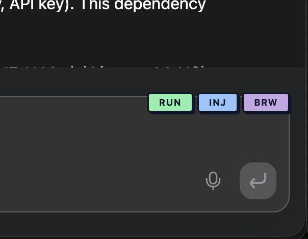
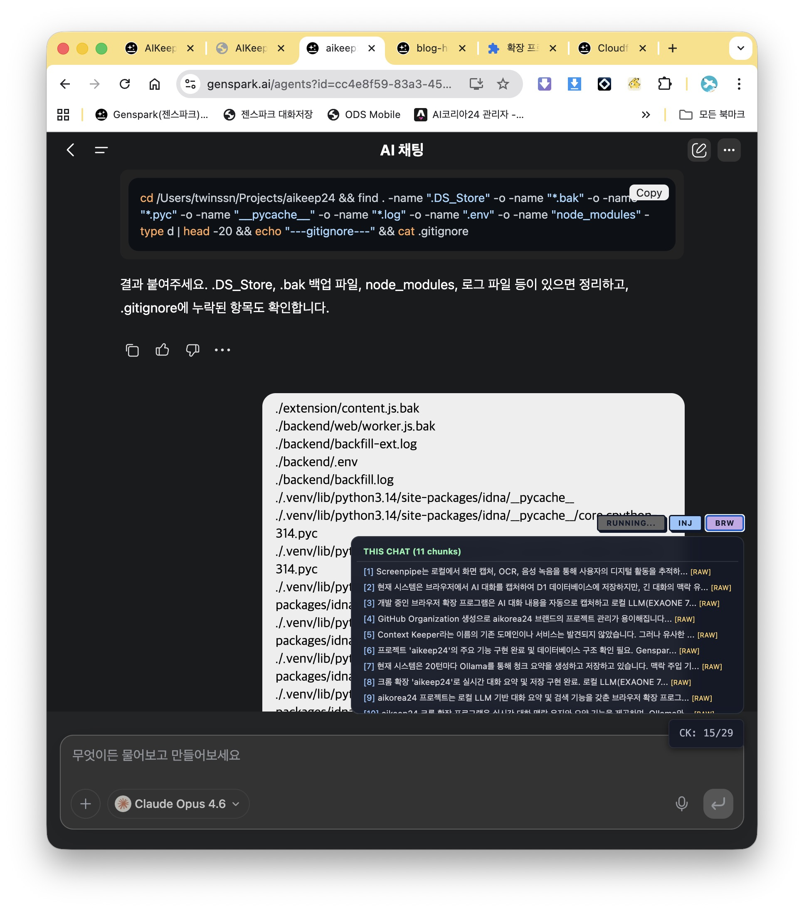
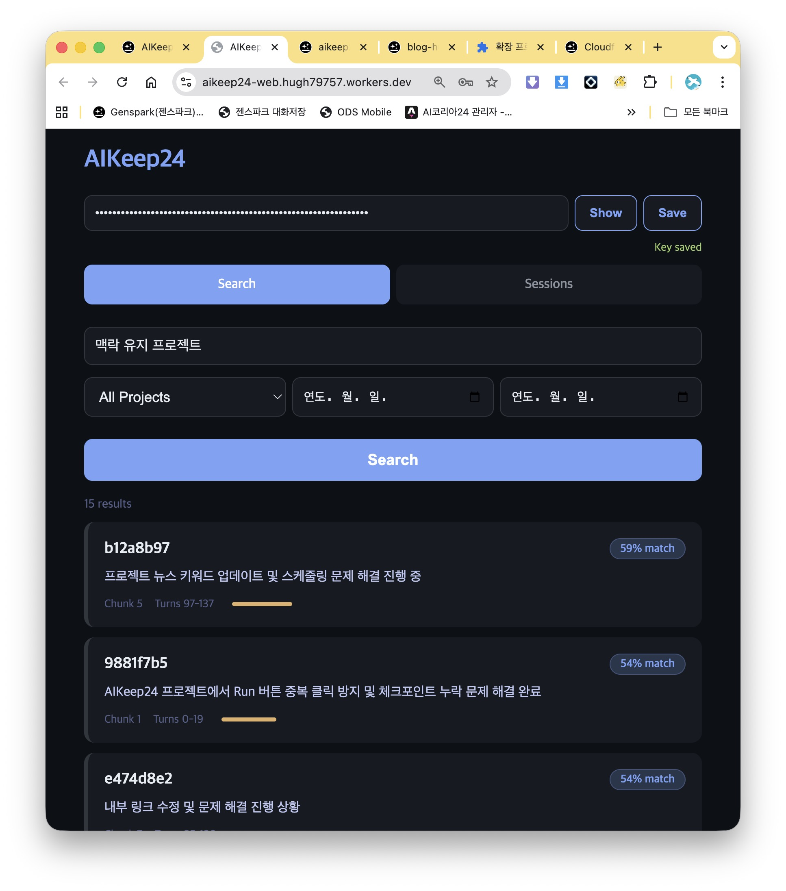
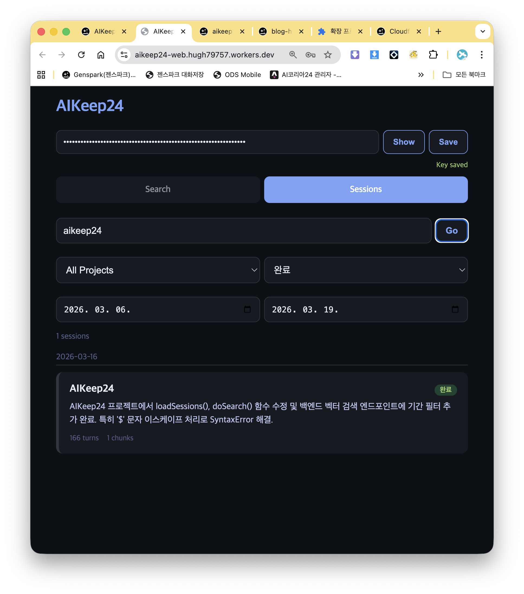
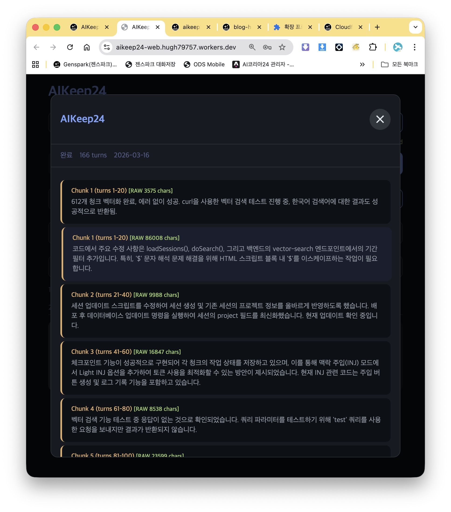

# AIKeep24

> **AI 대화의 맥락을 잃지 않도록, 로컬 LLM이 자동으로 요약·태그·저장하는 크롬 확장**
>
> _A Chrome extension that uses a local LLM to automatically summarize, tag, and store AI conversation context_

**GitHub**: [https://github.com/aikorea24/aikeep24](https://github.com/aikorea24/aikeep24)
**By**: [AI Korea 24](https://aikorea24.kr/)

---

## 문제 / The Problem

AI와 대화를 많이 하면 두 가지 문제가 생깁니다. 첫째, 새 세션을 열면 이전 대화의 맥락을 자동으로 이어받지 못합니다. 이전 대화 목록은 남아 있지만, 그 내용을 새 세션에서 활용하려면 직접 찾아서 복사해야 합니다. 둘째, 대화가 수십 개 쌓이면 "그때 그 아키텍처 결정이 어느 대화에 있었지?"를 찾기 어렵습니다. 기존 도구들(Pactify, Chat Memo, SaveAIChats)은 원문을 통째로 저장하기만 해서, 검색과 맥락 재활용이 불가능합니다.

AIKeep24는 대화를 요약·태깅하고, 세션 간 맥락을 자동 주입할 수 있는 **영구 기억**입니다.

AI chat platforms keep conversation history, but two problems remain. First, opening a new session doesn't carry over context from previous ones — you have to manually find and copy relevant information. Second, as conversations pile up, finding "which session had that architecture decision?" becomes nearly impossible. Existing tools like Pactify, Chat Memo, and SaveAIChats store raw transcripts without structure, making search and context reuse impractical.

AIKeep24 provides **permanent memory** — summarized, tagged, and searchable across sessions with automatic context injection.

---

## 해결 / The Solution

AIKeep24는 다릅니다. 대화를 실시간으로 감지하고, 로컬에서 돌아가는 LLM(EXAONE 3.5 7.8B)이 구간별로 요약하면서 프로젝트명·토픽·기술스택·핵심결정을 자동 태깅합니다. 저장된 요약은 Cloudflare Vectorize + bge-m3 임베딩을 통해 의미 기반 검색이 가능합니다. 클라우드 API를 쓰지 않으므로 비용이 들지 않고, 대화 내용이 외부 서버로 나가지 않습니다.

AIKeep24 detects conversation turns in real time and uses a local LLM (EXAONE 3.5 7.8B via Ollama) to summarize each segment, automatically tagging project names, topics, tech stack, and key decisions. Saved summaries are searchable via semantic vector search powered by Cloudflare Vectorize + bge-m3 embeddings. No cloud API costs, no data leaving your machine.

---

## Quick Start

    git clone https://github.com/aikorea24/aikeep24.git && cd aikeep24
    OLLAMA_ORIGINS='*' ollama serve & ollama pull exaone3.5:7.8b
    cd backend/web && npx wrangler secret put API_KEY && npx wrangler deploy

Then: chrome://extensions → Developer mode → Load unpacked → extension/ folder. Open Genspark and start chatting.

---

## 스크린샷 / Screenshots

### 크롬 확장 버튼 (ON / RUN / INJ / SNAP / BRW)

### BRW 패널 — 프로젝트 탐색

### AIKeep24-web 벡터 검색

### AIKeep24-web 세션 목록

### AIKeep24-web 세션 상세 (청크 목록)

---

## 핵심 기능 / Core Features

### 실시간 대화 감지 + 청크 단위 저장

크롬에서 AI와 대화하면 확장이 턴을 감지하고, 20턴 단위로 청크를 분할하여 로컬 LLM이 각 청크를 요약합니다. **각 청크는 완료 즉시 D1에 저장**되므로 긴 대화 도중에도 데이터가 유실되지 않습니다.

The extension detects conversation turns, splits them into 20-turn chunks, and summarizes each locally. Each chunk is saved to D1 immediately upon completion.

### 해시 기반 변경 감지 (v0.9 신규)

턴수 카운트 대신 마지막 턴의 텍스트 해시(FNV-1a, 앞 100자)로 변경을 판단합니다. 플랫폼이 DOM을 압축하거나 부분적으로 펼쳐도 정확하게 새 내용만 감지하며, 네트워크 호출 없이 로컬에서 비교합니다.

Instead of counting turns, detects changes by hashing the last turn's text (FNV-1a, first 100 chars). Accurately detects new content even when the platform compresses or partially expands DOM, with no network calls.

### 오토런 (v0.9 신규)

기존 120초 idle 타이머를 대체합니다. **마지막 새 턴 감지 후 5분간 추가 턴이 없을 때만 자동 실행**됩니다. 대화 중에는 절대 트리거하지 않으므로 요약이 대화를 방해하지 않습니다.

Replaces the old 120-second idle timer. **Auto-runs only after 5 minutes of no new turns** since the last detected turn. Never triggers during active conversation.

### 탭별 ON/OFF 토글 (v0.9 신규)

버튼 영역에 ON/OFF 스위치가 추가되었습니다. OFF인 탭에서는 RUN과 오토런이 모두 차단됩니다. Ollama가 한 번에 하나만 처리하므로, 여러 탭을 띄워놓고 하나에 집중해서 요약을 완료한 후 다음 탭을 수동 활성화하는 워크플로우에 적합합니다.

ON/OFF switch added to the button area. When OFF, both RUN and auto-run are blocked for that tab. Since Ollama processes one request at a time, you can open multiple tabs and focus on one at a time.

### 대화 유형 자동 필터링 (v0.9 신규)

이미지 생성, 그림 편집 등 요약이 불필요한 대화를 URL 패턴과 DOM 요소로 자동 감지하여 RUN/오토런을 비활성화합니다. 코드가 없는 순수 이미지 대화에 리소스를 낭비하지 않습니다.

Automatically detects image generation and non-text conversations by URL pattern and DOM elements, disabling RUN/auto-run. Saves resources on pure image conversations.

### 벡터 검색 + 메타데이터 하이브리드

Cloudflare Vectorize와 Workers AI(bge-m3, 1024차원, 100개+ 언어)를 사용한 의미 기반 검색입니다. 프로젝트 드롭다운과 기간 필터를 조합할 수 있습니다.

Semantic search powered by Cloudflare Vectorize and Workers AI (bge-m3, 1024 dimensions, 100+ languages). Combine with project dropdown and date range filters.

### 맥락 주입 — INJ 범용화 (v0.9 신규)

**INJ** 버튼으로 맥락 요약을 클립보드에 복사합니다. 짧게 누르면 Light, 길게 누르면 Full 모드. v0.9에서 개발 전용 필드(files_modified, tech_stack)를 모든 대화에 공통으로 유용한 4개 필드로 통일했습니다: **summary**(무엇을 논의했는가), **decisions**(무엇이 결정됐는가), **unresolved**(무엇이 남았는가), **topics**(핵심 키워드). 개발 대화에서만 files_modified가 보너스로 추가됩니다.

**INJ** copies context to clipboard. Short press for Light, long press for Full. v0.9 unified dev-specific fields into 4 universal fields: **summary**, **decisions**, **unresolved**, **topics**. files_modified is added only for development conversations.

### INJ 프로젝트 누적 컨텍스트 (v0.9 신규)

기존에는 가장 최근 세션 하나의 체크포인트만 가져왔지만, 이제 같은 프로젝트의 **최근 5개 세션의 청크를 통합**하여 주입합니다. 최신 세션부터 역순으로 넣되 토큰 한도 내에서 최대한 채웁니다.

Previously only the latest session's checkpoint was injected. Now **up to 5 recent sessions** from the same project are merged. Latest sessions first, within token limits.

### 체크포인트 체이닝

**BRW** 버튼으로 이전 세션의 맥락을 불러와 주입합니다. "어제 어디까지 했지?"가 필요 없어집니다.

Use **BRW** to load previous session context from D1. No more "where did we leave off?"

### 브라우저 내 벡터 검색

BRW 패널 상단의 검색창에서 자연어로 벡터 검색이 가능합니다. 대화 중에 웹 UI로 전환할 필요 없이, 확장 패널 안에서 바로 과거 맥락을 검색하고 클립보드에 복사할 수 있습니다.

Search semantically from the BRW panel's search bar without switching to the web UI. Find past context and copy it to clipboard directly within the extension.

### 자동 트리거

오토런이 5분 idle 기반으로 동작합니다. burst 감지(+50턴 이상 동시 증가)로 불필요한 자동 저장을 방지합니다.

Auto-run triggers after 5 minutes of idle. Burst detection (+50 turns) prevents unnecessary auto-saves.

### 원문 보존

청크별 원문 대화도 함께 저장되어 나중에 확인할 수 있습니다.

Raw conversation text is stored alongside summaries.

---

### 버튼 가이드 / Button Guide

크롬 확장은 대화창 하단에 5개 버튼을 표시합니다.

The Chrome extension displays 5 buttons at the bottom of the chat interface.

### ON/OFF — 탭 토글 (v0.9 신규)

| 동작 / Action | 설명 / Description |
|---|---|
| 클릭 / Click | 현재 탭의 RUN/오토런 활성화·비활성화 토글 / Toggle RUN/auto-run for current tab |
| ON (초록) | 활성화 — 모든 기능 동작 / Enabled — all features active |
| OFF (빨강) | 비활성화 — RUN, 오토런 차단 / Disabled — RUN and auto-run blocked |

### RUN — 수동 요약 실행

| 동작 / Action | 설명 / Description |
|---|---|
| 클릭 / Click | 미저장 턴을 즉시 요약하고 D1에 저장 / Summarize unsaved turns and save to D1 |
| 길게 누르기 (2초) / Long press (2s) | 확장 리로드 + 페이지 새로고침 / Reload extension + refresh page |
| 자동 실행 / Auto | 5분 idle 후 자동 실행 (v0.9) / Auto-run after 5min idle |

### INJ — 맥락 주입

| 동작 / Action | 설명 / Description |
|---|---|
| 짧게 클릭 / Short click | Light: 체크포인트 + 결정사항을 클립보드에 복사 / Copy checkpoint + decisions to clipboard |
| 길게 누르기 / Long press | Full: 프로젝트 누적 컨텍스트 (최근 5세션) / Project cumulative context (up to 5 sessions) |
| 사용법 / Usage | 복사된 내용을 대화 입력창에 붙여넣기(Cmd+V) / Paste into chat input (Cmd+V) |

### SNAP — 최근 턴 원문 복사

| 동작 / Action | 설명 / Description |
|---|---|
| 클릭 / Click | 최근 10턴의 원문을 클립보드에 복사 / Copy last 10 turns raw text to clipboard |
| 용도 / Use case | LLM 요약 없이 원문 그대로 전달할 때 / When raw text is needed without LLM summarization |

### BRW — 프로젝트 탐색

| 동작 / Action | 설명 / Description |
|---|---|
| 클릭 / Click | 현재 대화의 청크 목록 표시 / Show chunk list for current conversation |
| ALL SESSIONS | 전체 세션 목록 / All sessions |
| 청크 클릭 / Chunk click | 원문을 클립보드에 복사 / Copy raw content to clipboard |
| 검색 / Search | 검색창에 입력 후 Enter — 벡터 검색 / Type query + Enter — vector search |

---

## 아키텍처 / Architecture

    Browser (Genspark)
      → config.js → dom-parser.js → ollama.js → api.js → summarizer.js → ui.js → observer.js → content.js
      → background.js → localhost:11434 (EXAONE 3.5 7.8B)
      → chunk summary + checkpoint
      → background.js → Cloudflare Worker (Bearer auth)
      → D1 (ext_sessions + ext_chunks)
      → Workers AI (bge-m3, 1024 dims)
      → Vectorize (vector index)

---

## 파일 구조 / File Structure

    aikeep24/
    ├── extension/                    # Chrome Extension (v0.9 modular)
    │   ├── manifest.json             # Chrome MV3, 8개 content script 순서 로드
    │   ├── config.js                 # 설정 + 공통 유틸 (38 lines)
    │   ├── dom-parser.js             # DOM 추출 + 해시 감지 + 유형 필터 (61 lines)
    │   ├── ollama.js                 # LLM 호출 + JSON/checkpoint 파싱 (67 lines)
    │   ├── api.js                    # Worker API 클라이언트 (118 lines)
    │   ├── summarizer.js             # 요약 엔진 + INJ 범용화 (329 lines)
    │   ├── ui.js                     # UI 버튼 + BRW 패널 (409 lines)
    │   ├── observer.js               # MutationObserver + 오토런 (123 lines)
    │   ├── content.js                # 진입점 (43 lines)
    │   └── background.js             # 메시지 핸들러 + Ollama 큐 (168 lines)
    ├── backend/web/                  # Cloudflare Worker (v0.9.1 modular)
    │   ├── worker.js                 # 라우터 진입점 (44 lines)
    │   ├── middleware.js             # CORS + 인증 + 응답 헬퍼 (30 lines)
    │   ├── handlers/
    │   │   ├── notes.js              # 노트 CRUD (65 lines)
    │   │   ├── sessions.js           # 세션/청크 저장 (122 lines)
    │   │   └── search.js             # 벡터검색/세션검색/프로젝트 (109 lines)
    │   ├── views/
    │   │   └── dashboard.js          # 프론트엔드 HTML (353 lines)
    │   └── wrangler.toml             # D1 + Vectorize + AI bindings
    ├── scripts/
    │   ├── lib/
    │   │   ├── config.py             # 공통 설정 (Ollama URL, Worker URL 등)
    │   │   └── __init__.py
    │   ├── backfill-summaries.py     # 소급 요약 (Ollama)
    │   ├── backfill-ext.py           # 키워드/카테고리 보강
    │   ├── sync-obsidian-to-d1.py    # Obsidian → D1 + R2 동기화
    │   └── check-db-status.py        # DB 상태 점검
    ├── docs/
    │   └── screenshots/
    ├── .env.example                  # 환경변수 템플릿
    ├── requirements.txt              # Python 의존성
    ├── README.md
    ├── LICENSE                       # AGPL-3.0
    └── .gitignore

---

## 사전 준비 / Prerequisites

| 항목 | 세부 |
|---|---|
| OS | macOS (Apple Silicon M2/M4) / Linux |
| RAM | 16GB+ 권장 |
| Browser | Chrome |
| LLM | Ollama + EXAONE 3.5 7.8B (4.7GB) |
| Cloud | Cloudflare 무료 계정 |
| Runtime | Node.js 18+ |

---

## 설치 / Installation

**1. Clone**

    git clone https://github.com/aikorea24/aikeep24.git
    cd aikeep24

**2. Ollama + EXAONE**

    OLLAMA_ORIGINS='*' ollama serve &
    sleep 3
    ollama pull exaone3.5:7.8b

**3. Cloudflare Backend**

    cd backend/web
    npx wrangler d1 create obsidian-db
    npx wrangler d1 execute obsidian-db --remote --file=../../sql/create-tables.sql
    npx wrangler vectorize create aikeep24-vectors --dimensions=1024 --metric=cosine
    npx wrangler secret put API_KEY
    npx wrangler deploy

**4. Chrome Extension**

chrome://extensions → Developer mode ON → Load unpacked → extension/ folder

**5. API Key**

확장의 Service Worker 콘솔에서:

    chrome.storage.local.set({ck_api_key: 'YOUR_API_KEY_HERE'});

---

## 기존 도구와의 차이 / Comparison

기존 AI 대화 저장 도구들은 원문을 그대로 저장하는 데 초점이 맞춰져 있습니다. AIKeep24는 다른 문제를 풉니다 — 대화를 요약·태깅하고, 의미 기반으로 검색하고, 새 세션에 맥락을 자동 주입합니다.

Existing AI conversation tools focus on saving raw transcripts. AIKeep24 solves a different problem — summarizing and tagging conversations, searching by meaning, and auto-injecting context into new sessions.

---

## D1 스키마 / Database Schema

**ext_sessions**

    session_id TEXT PRIMARY KEY
    title, source, url, summary TEXT
    topics, key_decisions, tech_stack TEXT  -- JSON arrays
    project, status, checkpoint TEXT
    total_chunks, total_turns INTEGER
    created_at, synced_at TIMESTAMP

**ext_chunks**

    chunk_id TEXT PRIMARY KEY
    session_id TEXT NOT NULL  -- FK → ext_sessions
    chunk_index INTEGER
    turn_start, turn_end INTEGER
    chunk_summary, chunk_checkpoint TEXT
    chunk_topics, chunk_key_decisions TEXT  -- JSON arrays
    raw_content, project TEXT
    -- Vector: summary+checkpoint → bge-m3 (1024d) → Vectorize

---

## 프로젝트 진화 / How This Project Evolved

이 프로젝트는 처음 계획과 크게 달라졌습니다. 그 과정 자체가 바이브코딩의 현실을 보여줍니다.

**Phase 1 — 발견**: Obsidian 노트를 D1에 동기화하는 도구로 시작. 117개 노트를 로컬 LLM으로 요약하면서 "이걸 실시간 대화에 적용하면?"이라는 아이디어 탄생.

**Phase 2 — 구현**: 크롬 확장으로 Genspark 대화 실시간 감지, 20턴 청크 분할, EXAONE 요약, D1 저장. CORS 해결, 체크포인트 시스템 구축.

**Phase 3 — 안정화**: Ollama 큐, 타임아웃 재시도, 자동 트리거, burst 감지, 청크 단위 실시간 저장, Browse 버튼, 검색 UI, 할루시네이션 수정.

**Phase 4 — 리팩토링 + 기능 강화**: 코드 품질 대규모 개선. content.js(985줄)를 8개 모듈로 분리, worker.js(765줄)를 6개 모듈로 분리. 해시 기반 변경 감지, 5분 idle 오토런, 탭 토글, 대화 유형 필터링, INJ 범용화(공통 4필드), 프로젝트 누적 컨텍스트(최근 5세션 통합), Python 스크립트 설정 중앙화.

---

## 왜 오픈소스인가 / Why Open Source

**신뢰**: AI 대화를 캡처하는 도구는 본질적으로 민감합니다. 코드 공개로 "내 대화가 어디로 가는 거지?"라는 의심을 제거합니다.

---

## 현재 상태 / Current Status

**v0.9.3 — Phase 4 Complete**

- 120+ 세션, 793+ 청크, 12,500+ 턴, 90+ 프로젝트 저장
- 벡터 검색 (Vectorize + bge-m3, 1024차원)
- 서버사이드 필터링 + 기간 필터
- 원문 보존, 할루시네이션 방지 프롬프트
- v0.9.0: 모듈 분리 (content.js 985줄 → 8파일, worker.js 765줄 → 6파일)
- v0.9.0: 해시 기반 변경 감지, 5분 idle 오토런, 탭 ON/OFF 토글
- v0.9.0: 대화 유형 자동 필터링 (이미지/비텍스트 스킵)
- v0.9.0: INJ 범용화 (공통 4필드) + 프로젝트 누적 컨텍스트 (최근 5세션)
- v0.9.1: worker.js 모듈 분리 + Python 설정 중앙화 + Cloudflare 배포 확인
- v0.9.3: Phase 4 완료 — Docstring 100%, pytest 30개 테스트, CI/CD, 타입 힌트, logging 표준화, 파비콘
- v0.9.3: Phase 4 complete — Docstring 100%, pytest 30 tests, CI/CD, type hints, logging standardization, favicon

---

## 로드맵 / Roadmap

**Phase 4 (완료 / Complete)**

- ✅ Docstring 보강 (39개 함수 100%) / Docstring coverage (39 functions, 100%)
- ✅ 테스트 환경 구축 (pytest + 30개 단위 테스트) / Test setup (pytest + 30 unit tests)
- ✅ CI/CD (GitHub Actions — ruff + ast.parse + node --check + pytest)
- ✅ Python 타입 힌트 + logging 표준화 / Type hints + logging standardization
- ✅ 파비콘/아이콘 (크롬 확장 + 웹 대시보드) / Favicon/icons (extension + web dashboard)

**Phase 5 (계획 / Planned)**

- 내보내기 — Markdown/JSON (Obsidian, Notion 등) / Export — Markdown/JSON (Obsidian, Notion, etc.)
- 세션 관리 — 검색 UI에서 삭제/편집 / Session management — delete/edit from search UI
- 프로젝트 메모리 — 프로젝트별 누적 지식 문서 자동 생성 (필요 시) / Project memory — auto-generated cumulative knowledge docs per project (if needed)

---

## 알려진 한계 / Known Limitations

**Genspark 전용** — 현재 Genspark DOM에만 대응. Claude.ai, ChatGPT는 로드맵.

**Apple Silicon + 16GB 권장** — EXAONE 3.5 7.8B(4.7GB) 로컬 실행 기준.

**로컬 LLM 할루시네이션** — 4턴 미만 짧은 대화에서 발생 가능. 방지 프롬프트 적용됨.

**Cloudflare 설정 필요** — D1, Vectorize, Worker 배포 필요. 로컬 전용 모드로 제거 예정.

**EXAONE 라이선스** — 비상업적 사용만 허용(1.1-NC). 상업 사용 시 Llama 3, Mistral, Gemma로 교체 가능.

---

## 기여 / Contributing

이슈와 PR을 환영합니다. Issues and PRs are welcome.

- **AI 플랫폼 DOM 셀렉터** — Claude.ai, ChatGPT, Gemini 턴 감지 셀렉터 추가
- **로컬 LLM 테스트** — Llama 3, Mistral, Gemma 요약 품질 비교
- **번역** — UI/문서 다국어 지원
- **버그 리포트**

---

## 기술 스택 / Tech Stack

- **Extension**: Chrome MV3, MutationObserver, modular architecture (8 modules)
- **Local LLM**: Ollama + EXAONE 3.5 7.8B (Q4_K_M, 4.7GB)
- **Vector Search**: Cloudflare Vectorize + Workers AI bge-m3 (1024d)
- **Backend**: Cloudflare Workers (modular — 6 files)
- **Database**: Cloudflare D1 (SQLite-compatible)
- **Languages**: JavaScript (extension + Worker), Python (scripts)

---

## 변경 이력 / Changelog

### v0.9.3 (2026-03-28)

- Phase 4 완료: Docstring 39개 함수 100%, pytest 30개 테스트, GitHub Actions CI
- Python 전체 타입 힌트 + print→logging 표준화
- 파비콘/아이콘 추가 (크롬 확장 + 웹 대시보드)
- 버그 수정: Running 중 OFF 토글 시 RUN 버튼 비활성 유지 문제

- Phase 4 complete: Docstring 39 functions 100%, pytest 30 tests, GitHub Actions CI
- Full Python type hints + print→logging standardization
- Favicon/icons added (Chrome extension + web dashboard)
- Bugfix: RUN button stayed disabled when toggling OFF during Running state

### v0.9.1 (2026-03-28)

- worker.js(765줄) → 6개 모듈로 분리 (router/middleware/handlers/views)
- Python 스크립트 하드코딩 URL → scripts/lib/config.py 공통 모듈
- Cloudflare Workers 배포 확인

### v0.9.0 (2026-03-28)

- content.js(985줄) → 8개 모듈로 분리 (config/dom-parser/ollama/api/summarizer/ui/observer/content)
- background.js 하드코딩 URL → 설정 객체 중앙화
- 해시 기반 변경 감지 (FNV-1a, 마지막 턴 앞 100자)
- 오토런: 120초 idle → 5분 idle 기반, 대화 중 트리거 방지
- 탭별 ON/OFF 토글 버튼
- 대화 유형 자동 필터링 (이미지/비텍스트 대화 스킵)
- INJ 범용화: 개발 전용 필드 → 공통 4필드 (summary/decisions/unresolved/topics)
- INJ 프로젝트 누적 컨텍스트: 최근 5개 세션 통합
- INJ 구조화된 필드 조합: JSON 필드 직접 사용
- requirements.txt, .env.example 생성

---

## 라이선스 / License

[AGPL-3.0](https://github.com/aikorea24/aikeep24/blob/main/LICENSE)

개인 사용 자유. 상업적 사용 문의: info@aikorea24.kr

Free for personal use. Commercial licensing: info@aikorea24.kr

---

## 연락처 / Contact

- **Email**: info@aikorea24.kr
- **Web**: [aikorea24.kr](https://aikorea24.kr/)
- **GitHub**: [AI Korea 24](https://github.com/aikorea24)

---
